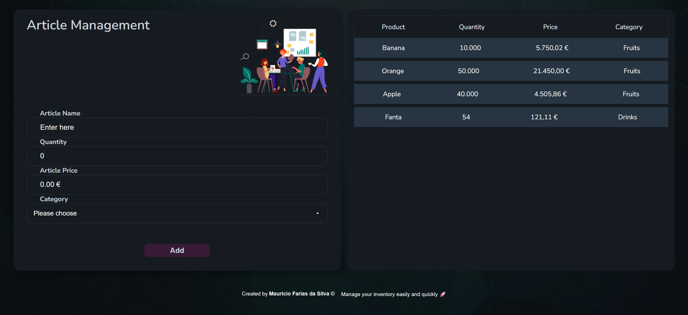

# 📦 Artikelverwaltung

A simple **article/product management application**, built to practice concepts of **JavaScript, HTML, CSS, and Express**.
The application allows you to create, view, and manage articles with basic information such as name, quantity, price, and category.



---

## 🚀 Features

* ✅ Add new articles with name, quantity, price, and category
* ✅ List all registered articles
* ✅ Clean and intuitive interface
* ✅ Ready-to-expand structure (e.g., database integration)

---

## 🛠️ Technologies Used

| Technology            | Purpose                       |
| :-------------------- | :---------------------------- |
| **HTML5**             | Application structure         |
| **CSS3**              | Styling and responsive layout |
| **JavaScript (ES6+)** | Interaction logic             |
| **Node.js + Express** | Backend and routes            |
| **Render**            | Application deployment        |

---

## 📂 Project Structure

```
Artikelverwaltung/
├── public/
│   ├── index.html
│   ├── assets/
│   │   ├── icons/
│   │   ├── img/
│   │   ├── main.js
│   │   └── modules/
├── style/
│   └── *.css (various stylesheets)
└── README.md
```

---

## ⚙️ Installation & Setup

### Prerequisites

* Node.js (v14 or higher)
* npm (comes with Node.js)

### Quick Start

1. **Clone the repository:**

   ```bash
   git clone https://github.com/Mauricioibzde/Artikelverwaltung.git
   cd Artikelverwaltung
   ```

2. **Install dependencies:**

   ```bash
   npm install
   ```

3. **Start the application:**

   ```bash
   npm start
   ```

4. **Open in your browser:**

   ```
   http://localhost:3000
   ```

---

## 💡 How to Use

1. Add new articles by filling in the form with name, quantity, price, and category
2. View all registered articles in the list
3. Manage and organize your inventory

---

## 📄 License

MIT License - Open Source

---

## 👨‍💻 Author

**Maurício Ibizde** - [GitHub](https://github.com/Mauricioibzde)


---

## 🤝 Contributing

Contributions, issues, and feature requests are welcome!
Feel free to check the [issues page](../../issues) if you want to propose improvements or report bugs.

### How to Contribute

1. Fork this repository
2. Create a new branch (`git checkout -b feature/YourFeature`)
3. Commit your changes (`git commit -m 'Add some feature'`)
4. Push to the branch (`git push origin feature/YourFeature`)
5. Open a Pull Request

---

⭐ If you like this project, don’t forget to give it a star on GitHub!
